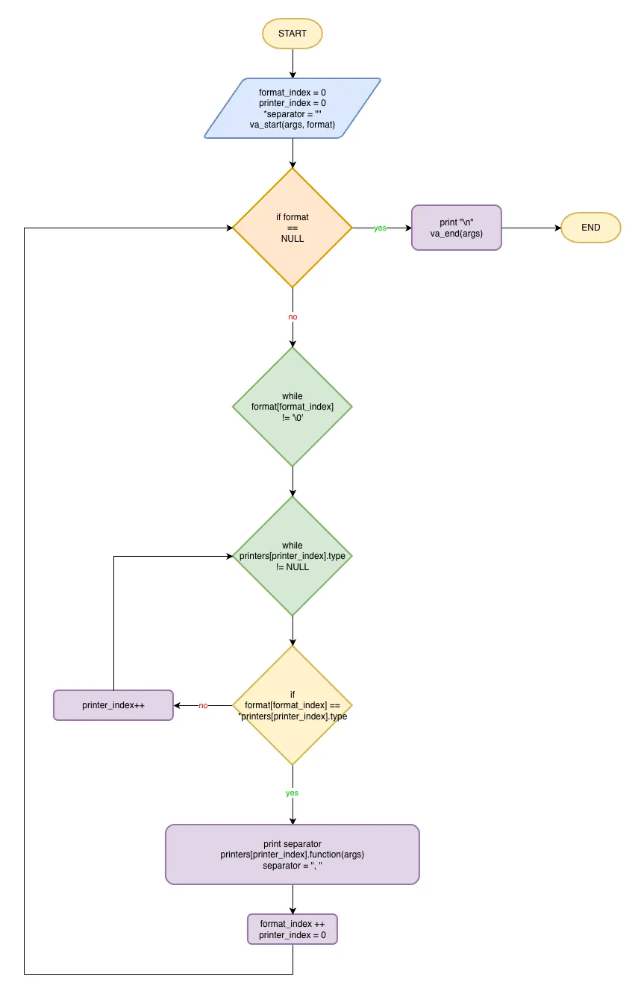

# PLD Flowchart Solution

## Description

This repository contains the reference solution to a pedagogical exercise given to students at Holberton School during a Peer Learning Day in the Foundations program.

The goal of the activity was to teach first-year students:

- How to analyze a low-level programming problem.
- How to design a flowchart from scratch.
- How to understand and implement variadic functions in C.
- How to respect strict constraints (no ternary, no else, max 2 if, max 2 while…).
- How to translate a diagram into working C code.

Students were grouped in teams of five, and their objective was to produce, by the end of the day, a fully functional flowchart describing the algorithm behind the `print_all` function.

This repository provides:
- A complete and validated flowchart.
- The corresponding C implementation.
- And a didactic reference that passes the Holberton automatic checks.

This is one possible solution among others, but it gives students a solid and accurate reference.



## Objectives

At the end of this project, you should be able to explain to anyone, **without the help of Google**:

- Explain how variadic functions work in C.
- Understand how `va_start`, `va_arg`, and `va_end` operate.
- Read and design a flowchart describing program logic.
- Translate a flowchart into a fully working implementation.
- Use structures and function pointers to implement a lightweight dispatcher.
- Respect strict low-level programming constraints.
- Produce clean, readable, and maintainable code.
- Work collaboratively within a group of peers.

## Requirements

- The programs and functions will be compiled with `gcc` using the flags `-Wall`, `-Werror`, `-Wextra` and `-pedantic`.
- All the files should end with a new line.
- The code should use the Betty style. It will be checked using [betty-style.pl](https://github.com/hs-hq/Betty/blob/main/betty-style.pl) and [betty-doc.pl](https://github.com/hs-hq/Betty/blob/main/betty-doc.pl).
- You are not allowed to use global variables.
- No more than 5 functions per file.
- The prototypes of all your functions should be included in your header file called `variadic_functions.h`.
- All your header files should be include guarded.

## Instructions

### Mandatory

<details>
    <summary>
        <b>3. To be is a to be the value of a variable</b>
    </summary>
    <br>

Write a function that prints anything.

- Prototype: `void print_all(const char * const format, ...);`.
- Where `format` is a list of types of arguments passed to the function:
    - `c`: `char`.
    - `i`: `integer`.
    - `f`: `float`.
    - `s`: `char *` (if the string is NULL, print `(nil)` instead).
    - any other char should be ignored.
    - see example.
- You are not allowed to use `for`, `goto`, ternary operator, `else`, `do ... while`.
- You can use a maximum of:
    - 2 `while` loops.
    - 2 `if`.
- You can declare a maximum of `9` variables.
- You are allowed to use `printf`.
- Print a new line at the end of your function.

```
julien@ubuntu:~/0x0f. Variadic functions$ cat 3-main.c
#include "variadic_functions.h"

/**
 * main - check the code
 *
 * Return: Always 0.
 */
int main(void)
{
    print_all("ceis", 'B', 3, "stSchool");
    return (0);
}
julien@ubuntu:~/0x0f. Variadic functions$ gcc -Wall -pedantic -Werror -Wextra -std=gnu89 3-main.c 3-print_all.c -o d
julien@ubuntu:~/0x0f. Variadic functions$ ./d 
B, 3, stSchool
julien@ubuntu:~/0x0f. Variadic functions$ 
```

#
**Repo:**
- GitHub repository: `repository_name`.
- Directory: `directory_name`.
- File: `file_name`.
<hr>
</details>

## Tech Stack


## File Description

| **FILE**             | **DESCRIPTION**                                         |
| :------------------: | ------------------------------------------------------- |
| `assets`             | Contains the resources required for the repository.     |
| `variadic_functions` | Folder containing the C solution files for the problem. |
| `README.md`          | The README file you are currently reading 😉.           |

## Installation & Usage

### Installation

1. Clone this repository:
    - Open your preferred Terminal.
    - Navigate to the directory where you want to clone the repository.
    - Run the following command:

```
git clone https://github.com/fchavonet/holbertonschool-pld_flowchart_solution.git
```

2. Open the cloned repository.

3. Compile the program :

```
gcc -Wall -pedantic -Werror -Wextra -std=gnu89 3-main.c 3-print_all.c -o d
```

### Usage

1. Run the program with the main test file :

```
./d
```

With the main test file included, you should obtain the following output:

```
B, 3, stSchool
```

## Thanks

- A big thank you to all the Holberton School students for their dedication and professionalism during our Peer Learning Days.

## Author(s)

**Fabien CHAVONET**
- GitHub: [@fchavonet](https://github.com/fchavonet)
